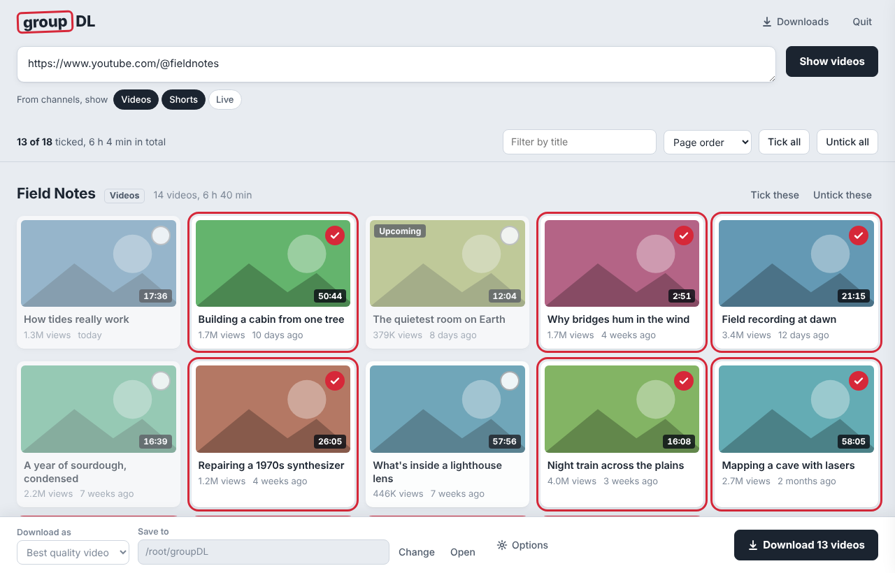

# groupDL

Paste a YouTube channel, playlist or video link and groupDL shows every video on that page as a contact sheet. Untick the ones you don't want, then download the rest in one go.



## Download

Get the file for your computer from the [latest release](https://github.com/terpenesalad/groupDL/releases/latest):

| Computer | File |
| --- | --- |
| Windows 10/11 | `groupDL-windows.exe` |
| Mac with Apple silicon (M1 or newer) | `groupDL-macos-arm64` |
| Linux (x86-64) | `groupDL-linux` |

Everything groupDL needs (yt-dlp, ffmpeg and Deno) is built in, so there's nothing else to install.

**Windows:** double-click `groupDL-windows.exe`. If SmartScreen warns about an unrecognised app, click *More info* then *Run anyway*.

**Mac:** the build isn't signed by Apple, so the first time open Terminal in the folder you downloaded it to and run:

```sh
chmod +x groupDL-macos-arm64
xattr -d com.apple.quarantine groupDL-macos-arm64
./groupDL-macos-arm64
```

After that you can double-click it.

**Linux:** `chmod +x groupDL-linux && ./groupDL-linux`

groupDL opens in your web browser. It runs entirely on your computer; the small window that appears alongside it is groupDL itself, so keep it open while you use the app. Close that window or click **Quit** to stop.

## Using it

1. Paste one or more links, one per line. Channels (`https://www.youtube.com/@name`), playlists, single videos and bare `@handles` all work.
2. For channels, choose which parts to show: **Videos**, **Shorts** and/or **Live**.
3. Click **Show videos**. Everything is ticked except upcoming premieres, live streams and members-only videos.
4. Click a video to tick or untick it. Shift-click to tick or untick a whole run. **Tick all** / **Untick all** apply to whatever matches the title filter, and each section has its own **Tick these** / **Untick these**.
5. Pick a format and a folder, then click **Download**. Progress shows on each thumbnail and in **Downloads**.
6. To cancel a big batch, click **Stop all** in the bottom bar. In **Downloads** you can also use **Stop waiting ones** (lets the videos already downloading finish and drops the rest), stop single videos, or **Retry all** to restart anything stopped or failed.

Every finished video is checked for sound. If YouTube's video and sound tracks didn't get joined, groupDL fetches the sound on its own and adds it. Half-finished pieces of stopped or failed downloads are deleted, so you won't find silent `.f137.mp4`-style files in your folder.

### Formats

- **Best quality video**, or video capped at **1080p**, **720p** or **480p** (MP4, falling back to MKV only when a format can't go in MP4)
- **Audio only** as **MP3** or **M4A**

### Options

- **Put each channel in its own folder** (on by default)
- **Skip videos downloaded before**: groupDL keeps a list in `.groupdl-archive.txt` in the save folder so re-running a channel only fetches new videos
- **Download at the same time**: 1 to 6 videos in parallel
- **Sign in using browser**: uses your YouTube login from Chrome, Firefox, Edge, Safari, Brave and others. Turn this on if you see "Sign in to confirm you're not a bot", or for age-restricted or members-only videos. Close that browser first if groupDL can't read its cookies.

Settings are remembered in `~/.groupdl/settings.json`.

## Running from source

Needs Python 3.10 or newer, and ffmpeg installed on your computer (`winget install ffmpeg`, `brew install ffmpeg` or your Linux package manager). The ffmpeg that pip installs as a fallback can crash when joining some YouTube streams.

```sh
git clone https://github.com/terpenesalad/groupDL
cd groupDL
pip install -e .
groupdl            # or: python -m groupdl
```

`groupdl --port 8080` picks the port, `groupdl --no-browser` skips opening a tab.

Build a single-file executable for the computer you're on:

```sh
pip install -r requirements.txt pyinstaller
python scripts/fetch_ffmpeg.py            # downloads a static ffmpeg into build/ffmpeg
python scripts/build.py --ffmpeg build/ffmpeg/ffmpeg   # result in dist/ (add .exe on Windows)
dist/groupDL --self-test                  # checks the bundled ffmpeg can join video and sound
```

Run the tests with `pip install pytest && pytest`.

## How it works

groupDL is a small Python program built on [yt-dlp](https://github.com/yt-dlp/yt-dlp). It serves its interface on `127.0.0.1` only, and every request from the page carries a random per-session key, so other websites can't drive it. Listing uses yt-dlp's fast "flat" mode, so even channels with thousands of videos load in seconds.

## When downloads stop working

YouTube changes often and yt-dlp keeps up with it. If listing or downloading starts failing, grab the newest groupDL release, which bundles the latest yt-dlp. From source, run `pip install -U "yt-dlp[default]"`.

Only download videos you have the right to keep, and respect YouTube's terms and creators' rights.
